Ziel dieses Projekts ist der praktische Aufbau und Betrieb einer kleinen IT-Infrastruktur im Homelab, um die theoretisch erlernten Inhalte aus dem Google IT Support Professional Certificate praktisch anzuwenden und zu dokumentieren. Das Projekt bildet typische Aufgaben eines Service-Desk-Mitarbeiters ab: Benutzerverwaltung über Active Directory, Support-Fallbearbeitung über ein Ticketsystem sowie grundlegende Windows-Client/Server-Administration.

# Architektur

# Umgesetzter Stand
- [x] Windows Server 2022 installiert und konfiguriert
- [x] Active Directory Domain Services (AD DS), Domäne homelab.local
- [x] OU-Struktur (IT, Support, Vertrieb) angelegt
- [x] Erster Benutzer angelegt
- [x] Windows-11-Client installiert, Netzwerk konfiguriert
- [x] Server und Client können sich gegenseitig erreichen (Ping erfolgreich)
- [x] Windows-Client in Domäne aufgenommen
- [ ] Ticketsystem eingerichtet

# Was ich dabei gelernt habe

Beim Einrichten des Windows Servers bin ich auf ein Netzwerkproblem gestoßen: 
der zweite Netzwerkadapter war in VirtualBox nicht aktiviert, wodurch die 
Domänenkommunikation zunächst nicht funktionierte. Dies hat mir gezeigt, wie 
wichtig es ist, Netzwerkkonfigurationen systematisch zu prüfen, bevor man 
nach komplexeren Ursachen sucht.

## Screenshots

### VirtualBox – Snapshot-Verlauf
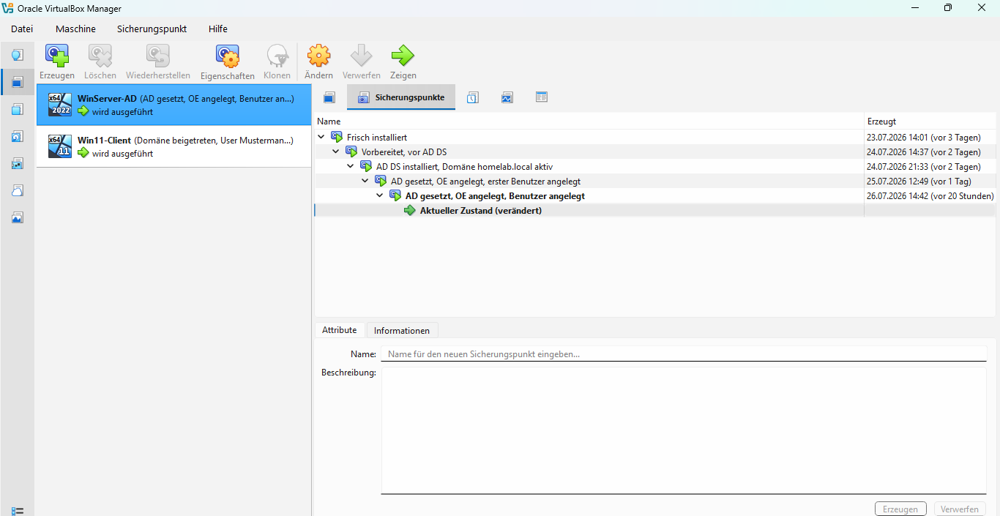

Jeder wichtige Meilenstein wurde als Snapshot gesichert – von der 
Frischinstallation bis zum Domänenbeitritt des Clients.

### Server- und Client-VM im Überblick
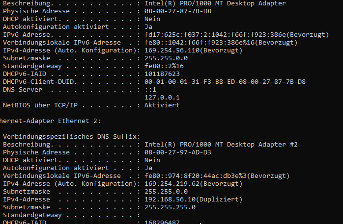
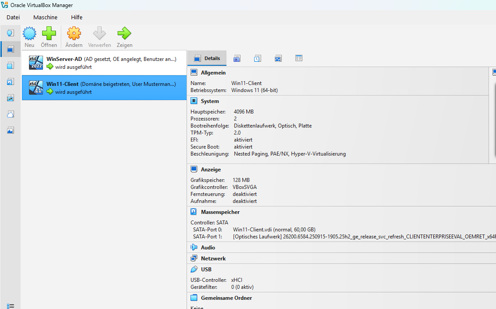

### VM-Erstellung: Ressourcenzuteilung
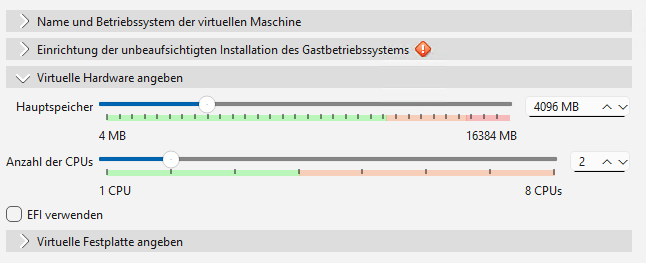

### Server-Manager: Lokaler Server
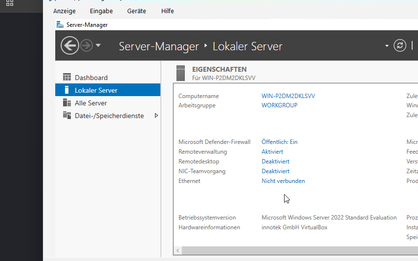

### Netzwerkadapter-Konfiguration (Host-only)
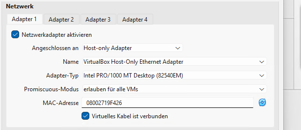
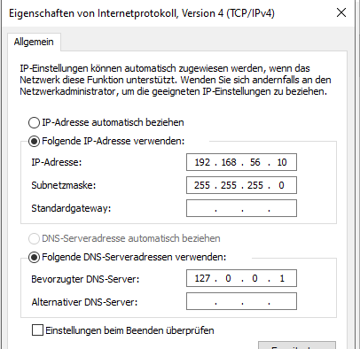

Feste IP-Adressen im internen Netz vergeben: Server `192.168.56.10`, 
Client `192.168.56.20`.

### Troubleshooting: IP-Adresskonflikt

**Fehlerbild:** Der zweite Netzwerkadapter (NAT) hatte versehentlich eine 
leere, ungültige manuelle IP-Konfiguration.
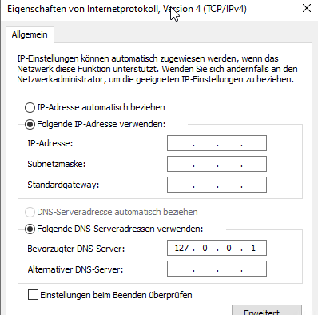

**Symptom:** Der Server zeigte bei seiner eigenen IP den Status „Dupliziert“, 
Ping zwischen Server und Client schlug fehl.
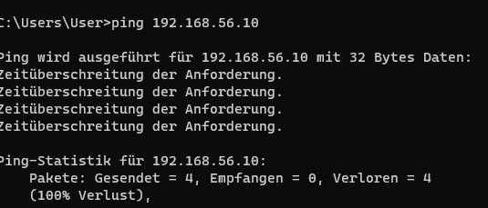
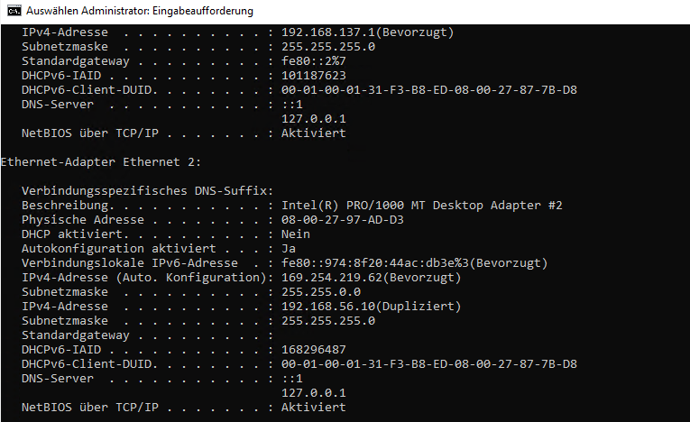

**Diagnose:** Mit `arp -a` vom Client aus die tatsächlich antwortende 
MAC-Adresse ermittelt und mit den bekannten Adaptern abgeglichen.
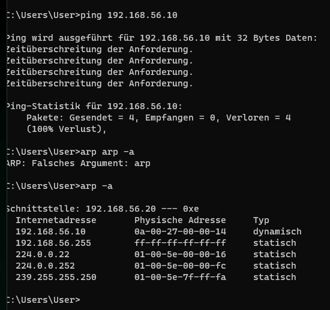
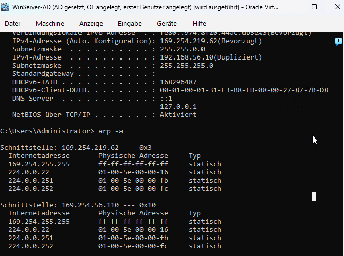

**Lösung:** Nach Korrektur der Host-Adapter-Konfiguration funktionierte die 
Kommunikation fehlerfrei.
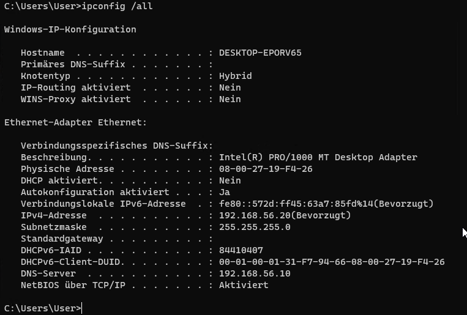
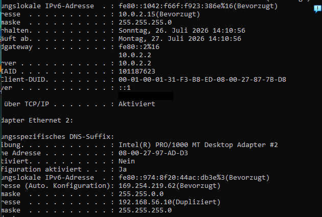
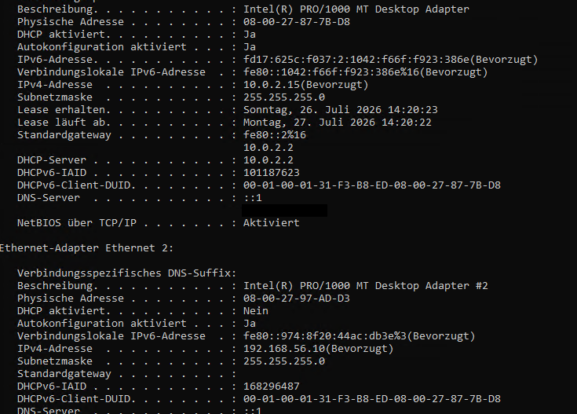

### Server-Identität nach Umbenennung (DC01)
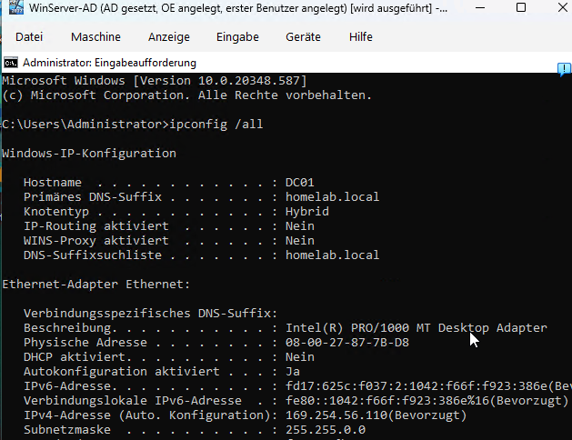

## Troubleshooting: Schwarzer Bildschirm bei Windows-11-Client-VM

Beim ersten Start der Windows-11-Client-VM blieb der Bildschirm in VirtualBox 
dauerhaft schwarz, obwohl die CPU-Auslastung im Hintergrund leicht schwankte – 
ein Hinweis darauf, dass die VM lief, aber nichts angezeigt wurde.

**Vorgehen:**
1. Grafikcontroller auf VMSVGA umgestellt, 3D-Beschleunigung deaktiviert – 
   keine Besserung
2. VBox.log gezielt nach Fehlern durchsucht (Suche nach "Error", "NEM", "EFI")
3. Fündig geworden: `HM: HMR3Init: Attempting fall back to NEM: VT-x is not available` 
   – VirtualBox konnte nicht direkt auf die Hardware-Virtualisierung (VT-x) 
   zugreifen und wich auf einen langsameren Software-Fallback aus
4. Windows Core Isolation / Memory Integrity deaktiviert – Problem blieb bestehen
5. `bcdedit /set hypervisorlaunchtype off` gesetzt – Problem blieb weiterhin bestehen
6. BIOS-Virtualisierung geprüft (Task-Manager → Leistung → CPU) – VT-x war 
   bereits aktiviert, also keine BIOS-Ursache
7. Über `msinfo32` festgestellt, dass "Virtualisierungsbasierte Sicherheit" 
   trotz aller Änderungen weiterhin lief, zusätzlich war "App Control for 
   Business" als Richtlinie erzwungen – ein Hinweis auf verbliebene 
   Enterprise-Sicherheitsrichtlinien (Device Guard/Credential Guard) aus der 
   vorherigen Nutzung des generalüberholten Business-Geräts

**Ursache:** Das gebraucht gekaufte Lenovo ThinkCentre M720q lief zuvor in 
einer Unternehmensumgebung mit aktivierten Device-Guard-/Credential-Guard-
Richtlinien. Diese Richtlinien blieben auch nach dem Refurbishing über die 
lokale Gruppenrichtlinie aktiv und aktivierten Windows' eigene 
Virtualisierungsschicht (Hyper-V/VBS) bei jedem Systemstart neu – dadurch 
stand VirtualBox kein direkter VT-x-Zugriff mehr zur Verfügung.

**Lösung:** Über die lokale Gruppenrichtlinie (`gpedit.msc` → 
Computerkonfiguration → Administrative Vorlagen → System → Device Guard) 
"Auf Virtualisierung basierende Sicherheit aktivieren" explizit auf 
**Deaktiviert** gesetzt (nicht nur "Nicht konfiguriert"), anschließend 
`gpupdate /force` und Neustart des Hosts. Danach lief die VM ohne 
Einschränkungen.

**Erkenntnis:** Bei gebrauchter Business-Hardware können Sicherheits-
richtlinien aus der vorherigen Nutzung tief im System verankert bleiben und 
sich nicht durch einfache Einstellungsänderungen beheben lassen. Die 
eigentliche Ursache ließ sich erst durch systematisches Auswerten der 
VirtualBox-Logs und der Windows-Systeminformationen statt durch reines 
Ausprobieren finden.

## Troubleshooting: IP-Adresskonflikt zwischen Host und Server-VM

Nach der Netzwerkkonfiguration von Server und Client meldete Windows Server 
bei seiner eigenen Host-only-IP (`192.168.56.10`) dauerhaft den Status 
„Dupliziert" und wich auf eine automatische Behelfsadresse (169.254.x.x) aus. 
Ping-Versuche zwischen Server und Client schlugen dadurch in beide 
Richtungen fehl.

**Vorgehen:**
1. Feste IP-Konfiguration auf Server und Client einzeln über `ipconfig /all` 
   geprüft – beide korrekt eingetragen, kein Tippfehler
2. Mit `arp -a` vom Client aus geprüft, welches Gerät tatsächlich auf 
   `192.168.56.10` antwortet
3. Die dabei ermittelte MAC-Adresse mit den bekannten Adaptern abgeglichen – 
   sie gehörte weder zum Server noch zum Client, sondern zum 
   **VirtualBox Host-Only-Adapter auf dem Host-PC selbst**
4. Festgestellt: Bei der vorherigen Fehlersuche wurde versehentlich auf dem 
   Host-Adapter (statt innerhalb der Server-VM) eine manuelle IP im selben 
   Adressbereich gesetzt – leicht passiert, da mehrere verschachtelte 
   Remotedesktop-/VM-Fenster gleichzeitig offen waren

**Ursache:** Zwei Geräte im selben internen Netzwerk (Host-PC und Server-VM) 
beanspruchten dieselbe IP-Adresse, weil die Netzwerkeinstellungen versehentlich 
auf der falschen Ebene (Host statt Gast-VM) geändert wurden.

**Lösung:** Die manuelle IP-Konfiguration auf dem Host-only-Adapter des 
Host-PCs zurück auf automatischen Bezug gestellt, sodass ausschließlich 
Server (`192.168.56.10`) und Client (`192.168.56.20`) feste Adressen im 
internen Netz halten. Nach einem Neustart des Adapters funktionierte die 
Kommunikation zwischen Server und Client fehlerfrei.

**Erkenntnis:** Bei verschachtelten Umgebungen (Host, Remotedesktop, mehrere 
VM-Fenster gleichzeitig) ist es entscheidend, vor jeder Netzwerkänderung zu 
prüfen, auf welcher Ebene man sich gerade befindet. Ein `arp -a` vom 
unbeteiligten dritten Gerät aus (hier: dem Client) war der entscheidende 
Schritt, um die Ursache eindeutig zu lokalisieren, statt nur auf dem 
betroffenen Server selbst zu suchen.

## Meilenstein: Client erfolgreich in Domäne aufgenommen

Nach Behebung des IP-Konflikts konnte der Windows-11-Client erfolgreich der 
Domäne `homelab.local` beitreten. Nach einem Neustart erfolgt der Login nun 
über das Domänenkonto (`HOMELAB\Administrator`), der Client erscheint 
korrekt im Container „Computers" der Active-Directory-Struktur auf dem Server.
